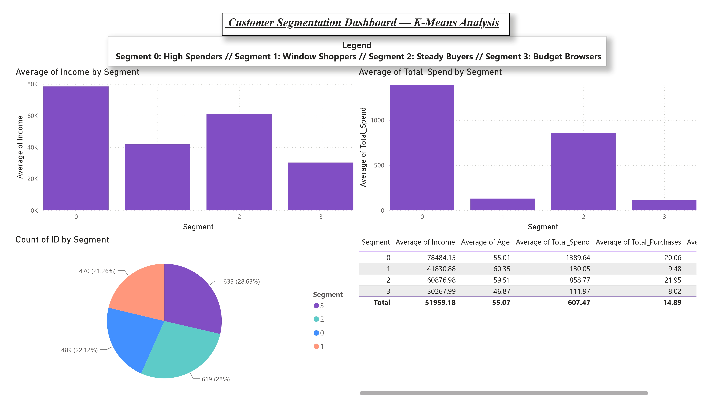

# Why Do Some Customers Browse But Never Buy?

### A Behavioural Analysis of Customer Segmentation Using K-Means Clustering

> **Working Paper | Consumer Behaviour | Marketing Psychology | Quantitative Research**
> 


---

## Research Question

Many firms assume that customers who frequently visit their website are closer to making a purchase.

This project investigates whether that assumption is actually supported by customer behaviour.

Using K-Means clustering, 2,211 customers were segmented according to purchasing behaviour, demographics, and online activity. Rather than treating clustering as the final objective, the resulting customer groups were interpreted through concepts from consumer psychology to explore whether frequent browsing reflects purchase intention—or a fundamentally different decision-making process.

> **The central finding is simple: customers who browse the most are not necessarily those who spend the most.**

---

## Overview

This project analyses the **Customer Personality Analysis** dataset to identify meaningful behavioural customer segments.

The analysis combines quantitative customer segmentation with behavioural interpretation to examine how browsing behaviour, purchasing behaviour, income, and demographics interact.

Instead of asking *"Which customers spend the most?"*, the project asks:

> **Why do some customers browse extensively but rarely buy?**

The accompanying whitepaper argues that this gap is better understood as a behavioural phenomenon rather than a purely economic one.

---

## Methodology

### Dataset

- Customer Personality Analysis dataset (Kaggle)
- Final sample: **2,211 customers**

### Data Cleaning

- Removed observations with missing income values
- Removed implausible income values (> $200,000)
- Removed unrealistic birth years (before 1940)

### Feature Engineering

Seven variables were included in the clustering analysis:

- Income
- Age
- Total Spend
- Total Purchases
- Number of Children
- Monthly Website Visits
- Purchase Recency

All variables were standardised before clustering.

### Cluster Selection

K-Means clustering was evaluated for **K = 2–8**.

Although a two-cluster solution achieved the highest silhouette score, it primarily separated customers into low- and high-spending groups with limited behavioural insight.

A four-cluster solution was therefore selected because it provided a better balance between statistical performance and behavioural interpretability, distinguishing customers not only by spending but also by browsing behaviour.

---

## Key Findings

The analysis identified four distinct behavioural customer groups.

### High Spenders

- Highest average spending
- Lowest browsing frequency
- Behaviour consistent with habitual or goal-directed purchasing

### Window Shoppers

- Browse frequently
- Purchase infrequently
- Extensive information search with limited conversion

### Steady Buyers

- Moderate browsing
- Moderate spending
- Consistent purchasing behaviour

### Budget Browsers

- Highest browsing frequency
- Lowest spending
- Behaviour potentially influenced by price sensitivity or purchase hesitation

Overall, the findings suggest that **website traffic alone should not be interpreted as a reliable indicator of purchase intention.**

---

# Dashboard

The customer segments were visualised using an interactive Power BI dashboard.



Additional dashboard screenshots are available in the **images** folder.

---

# Repository Structure

```
Customer-Segmentation-Kmeans
│
├── README.md
├── Whitepaper_Final.pdf
├── marketing_campaign.csv
│
├── notebook
│   └── customer_segmentation_analysis.ipynb
│
├── dashboard
│   └── customer_segmentation_dashboard.pbix
│
└── images
    ├── dashboard_page1.jpg
    ├── dashboard_page2.jpg
    ├── dashboard_page3.jpg
    └── dashboard_page4.jpg
```

---

# Working Paper

📄 **[Read the full whitepaper](./Whitepaper_Final.pdf)**

The paper expands on the methodology, customer profiles, behavioural interpretation, managerial implications, limitations, and future research directions.

---

# Tools

- Python
- pandas
- NumPy
- scikit-learn
- matplotlib
- Power BI
- Jupyter Notebook

---

# Research Contribution

Customer segmentation is often treated as a purely statistical exercise.

This project argues that clustering becomes substantially more valuable when interpreted through behavioural theory. The findings suggest that browsing frequency and purchasing behaviour may reflect different psychological processes, highlighting the importance of combining quantitative analysis with insights from consumer psychology.

Although exploratory in nature, the project illustrates how behavioural interpretation can complement quantitative customer analytics and generate research questions for future empirical investigation.

---

# Future Research

Potential extensions include:

- Longitudinal analysis of customer behaviour
- Experimental studies examining browsing-to-purchase mechanisms
- AI-assisted personalised marketing interventions
- Comparison with alternative clustering techniques
- Cross-cultural validation of behavioural customer segments

---

# Author

**Siddhant Vashishta**

*MSc Management, Cranfield University*

**Research Interests**

Consumer Behaviour • Marketing Psychology • Behavioural Decision Making • AI in Marketing • Quantitative Consumer Research

**LinkedIn**

https://www.linkedin.com/in/siddhant-vashishta

**SSRN**

*(Working paper to be uploaded)*
